<!-- Generated by generator/src/main.ts. Edit the generator, not this file. -->

<picture>
  <source media="(max-width: 600px)" srcset="dist/cover-narrow.svg">
  <source media="(prefers-color-scheme: dark)" srcset="dist/cover-dark.svg">
  
</picture>

<picture>
  <source media="(max-width: 600px)" srcset="dist/fig-claims-narrow.svg">
  <source media="(prefers-color-scheme: dark)" srcset="dist/fig-claims-dark.svg">
  
</picture>

<picture>
  <source media="(max-width: 600px)" srcset="dist/fig-portal-narrow.svg">
  <source media="(prefers-color-scheme: dark)" srcset="dist/fig-portal-dark.svg">
  
</picture>

<picture>
  <source media="(max-width: 600px)" srcset="dist/fig-cairn-narrow.svg">
  <source media="(prefers-color-scheme: dark)" srcset="dist/fig-cairn-dark.svg">
  
</picture>

<a href="https://github.com/isaacriehm/cairn">github.com/isaacriehm/cairn</a>

<picture>
  <source media="(max-width: 600px)" srcset="dist/specs-narrow.svg">
  <source media="(prefers-color-scheme: dark)" srcset="dist/specs-dark.svg">
  
</picture>

Upstream: <a href="https://github.com/openapi-ts/openapi-typescript/pull/2865">openapi-typescript #2865</a> (open pull request)

<picture>
  <source media="(max-width: 600px)" srcset="dist/terms-narrow.svg">
  <source media="(prefers-color-scheme: dark)" srcset="dist/terms-dark.svg">
  
</picture>

<a href="mailto:isaac@devplustech.com">Contract or full-time roles: isaac@devplustech.com</a> 
<a href="https://devplustech.com">A project for your business: devplustech.com</a> · (623) 252-4330

Figures are rendered daily from read-only GitHub data by <a href="generator/">the generator in this repository</a>. Private work appears only as counts, dates and short commit SHAs.
